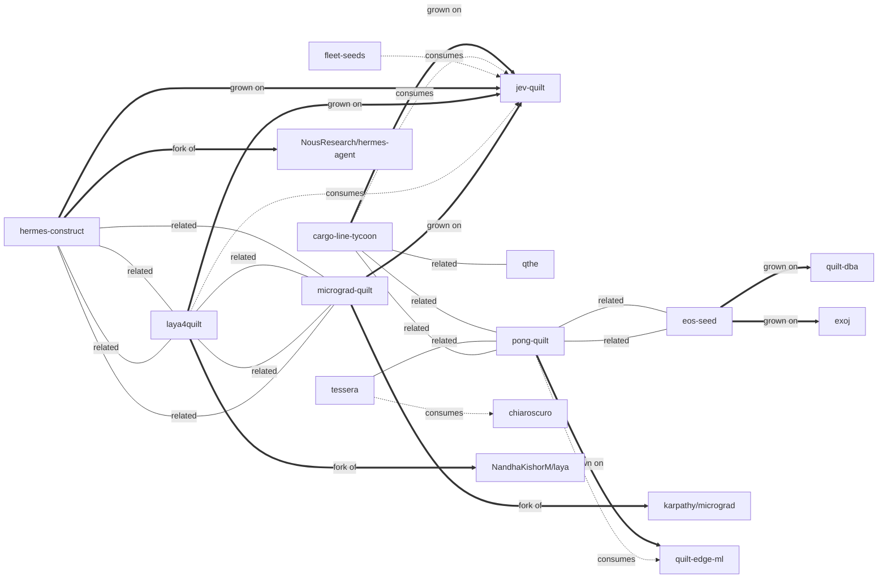

# Fleet map — the quilt fold

17 repos, 27 edges. Regenerated by `quilt-links.mjs --graph`.

| from | edge | to |
|---|---|---|
| cargo-line-tycoon | grown on | jev-quilt |
| cargo-line-tycoon | consumes | jev-quilt |
| cargo-line-tycoon | related | qthe |
| cargo-line-tycoon | related | pong-quilt |
| eos-seed | grown on | quilt-dba |
| eos-seed | grown on | exoj |
| eos-seed | related | pong-quilt |
| fleet-seeds | consumes | jev-quilt |
| hermes-construct | grown on | jev-quilt |
| hermes-construct | related | laya4quilt |
| hermes-construct | related | micrograd-quilt |
| hermes-construct | fork of | NousResearch/hermes-agent |
| laya4quilt | grown on | jev-quilt |
| laya4quilt | consumes | jev-quilt |
| laya4quilt | related | hermes-construct |
| laya4quilt | related | micrograd-quilt |
| laya4quilt | fork of | NandhaKishorM/laya |
| micrograd-quilt | grown on | jev-quilt |
| micrograd-quilt | related | laya4quilt |
| micrograd-quilt | related | hermes-construct |
| micrograd-quilt | fork of | karpathy/micrograd |
| pong-quilt | grown on | quilt-edge-ml |
| pong-quilt | consumes | quilt-edge-ml |
| pong-quilt | related | eos-seed |
| pong-quilt | related | cargo-line-tycoon |
| tessera | consumes | chiaroscuro |
| tessera | related | pong-quilt |
